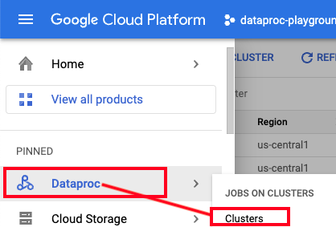
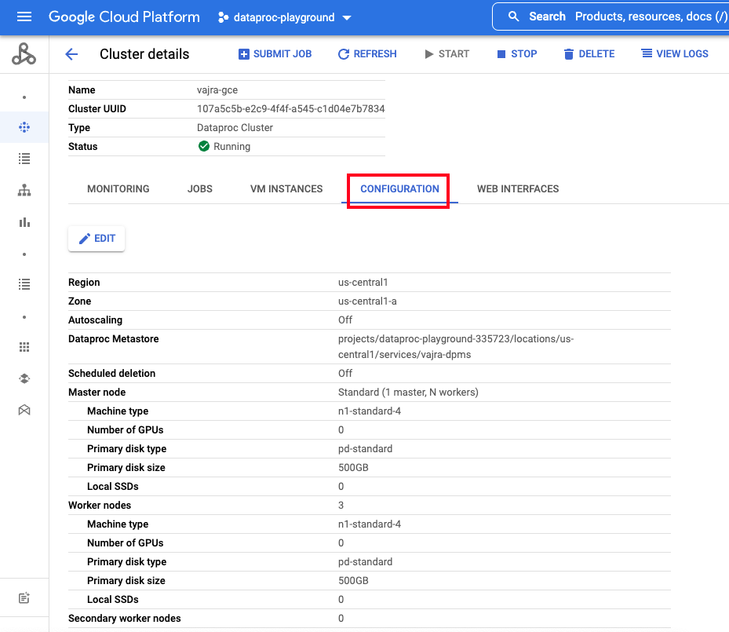

# About

This module covers creation of a Cloud Dataproc cluster, with a pre-created Dataproc Metastore Service, BigQuery Apache Spark connector, and with the optional component of Jupyter. 


## Lab Modules

| Module | Resource | 
| -- | :--- |
| 1 | [Foundational Setup](01-foundational-setup.md) |
| 2 | [Create a Spark Cluster](02-gce-create-spark-cluster.md) |


## Documentation resources

| Topic | Resource | 
| -- | :--- |
| 1 | blah](https://cloud.google.com/dataproc/docs) |


## 1. Pre-requisites

Completion of the prior module
<br>
  
<hr>

## 2. Variables

```
#The base_prefix below, is any keyword that you can prefix to your resources for traceability and for uniqueness
#for those services that require globally unique names. The author has used "zeus" for base prefix

BASE_PREFIX="zeus"  

#Replace with your details
ORG_ID=akhanolkar.altostrat.com                              
ORG_ID_NBR=236589261571
ADMINISTRATOR_UPN_FQN=admin@$ORG_ID 
PROJECT_ID=zeus-dataplex-p
PROJECT_NBR=902769668277
SECONDARY_PROJECT_ID=zeus-dataplex-s
SECONDARY_PROJECT_NBR=159402989543

#Your public IP address, to add to the firewall
YOUR_CIDR=98.222.97.10/32

#General variables
LOCATION=us-central1
ZONE=us-central1-a

UMSA="$BASE_PREFIX-sa"
UMSA_FQN=$UMSA@$PROJECT_ID.iam.gserviceaccount.com

SPARK_GCE_NM=$BASE_PREFIX-gce
PERSISTENT_HISTORY_SERVER_NM=$BASE_PREFIX-sphs

SPARK_GCE_BUCKET=$SPARK_GCE_NM-$PROJECT_ID-s
SPARK_GCE_BUCKET_FQN=gs://$SPARK_GCE_BUCKET
SPARK_GCE_TEMP_BUCKET=$SPARK_GCE_NM-$PROJECT_ID-t
SPARK_GCE_TEMP_BUCKET_FQN=gs://$SPARK_GCE_TEMP_BUCKET
PERSISTENT_HISTORY_SERVER_BUCKET_FQN=gs://$PERSISTENT_HISTORY_SERVER_NM-$PROJECT_NBR

DATAPROC_METASTORE_SERVICE_NM=$BASE_PREFIX-dpms

VPC_PROJ_ID=$PROJECT_ID        
VPC_PROJ_ID=$PROJECT_NBR  

VPC_NM=$BASE_PREFIX-vpc
SPARK_GCE_SUBNET_NM=$SPARK_GCE_NM-snet
SPARK_CATCH_ALL_SUBNET_NM=$BASE_PREFIX-misc-snet

DATA_BUCKET=$BASE_PREFIX-$PROJECT_NBR-data
BQ_DATASET_NM=$BASE_PREFIX_austin_bikeshare
HIVE_WAREHOUSE_BUCKET=$BASE_PREFIX-$PROJECT_NBR-hive-warehouse

DATA_BUCKET_SECONDARY=$BASE_PREFIX-$PROJECT_NBR-data-sec

SPARK_GCE_SUBNET_CIDR=10.0.0.0/16
SPARK_CATCH_ALL_SUBNET_CIDR=10.6.0.0/24
```
  
## 3. Create a Dataproc GCE cluster

Edit the version of the BigQuery connector to reflect the latest version in this Gig repos "latest" version-
https://github.com/GoogleCloudDataproc/spark-bigquery-connector


```
gcloud dataproc clusters create $SPARK_GCE_NM \
   --service-account=$UMSA_FQN \
   --project $PROJECT_ID \
   --subnet $SPARK_GCE_SUBNET_NM \
   --region $LOCATION \
   --zone $ZONE \
   --enable-component-gateway \
   --bucket $SPARK_GCE_BUCKET \
   --temp-bucket $SPARK_GCE_TEMP_BUCKET \
   --dataproc-metastore projects/$PROJECT_ID/locations/$LOCATION/services/$DATAPROC_METASTORE_SERVICE_NM \
   --master-machine-type n1-standard-4 \
   --master-boot-disk-size 500 \
   --num-workers 3 \
   --worker-machine-type n1-standard-4 \
   --worker-boot-disk-size 500 \
   --image-version 2.0-debian10 \
   --tags $SPARK_GCE_NM \
   --optional-components JUPYTER \
   --initialization-actions gs://goog-dataproc-initialization-actions-${LOCATION}/connectors/connectors.sh \
   --metadata spark-bigquery-connector-version=0.23.2
```

You should output as follows-
```
...
```

Here is a pictorial overview of the cluster-

   
  
<br><br>

   
  
<br><br>

   
  
<br><br>

   
  
<br><br>

   
  
<br><br>

   
  
<br><br>

   
  
<br><br>

   
  
<br><br>

   
  
<br><br>

   
  
<br><br>

   
  
<br><br>

   
  
<br><br>

<hr>


## 4. SSH to cluster

```
gcloud compute ssh --zone "$ZONE" "$SPARK_GCE_NM-m"  --project $PROJECT_ID
```

The above command allows you to SSH to the master node. To SSH to the other nodes, go via the Google Compute Engine UI route to get the gcloud commands.

<br><br>

<hr>

## 5. Smoke test the Dataproc cluster

```
gcloud dataproc batches submit spark \
--project=$PROJECT_ID \
--region=$LOCATION \
--subnet projects/$PROJECT_ID/regions/$LOCATION/subnetworks/$SPARK_GCE_SUBNET_NM \
--jars=file:///usr/lib/spark/examples/jars/spark-examples.jar \
--class org.apache.spark.examples.SparkPi -- 10000
```


This concludes the module. <br>

[Next Module](03-run-spark-batch-jobs.md) 
<br>
[Repo Landing Page](README.md)

<hr>
